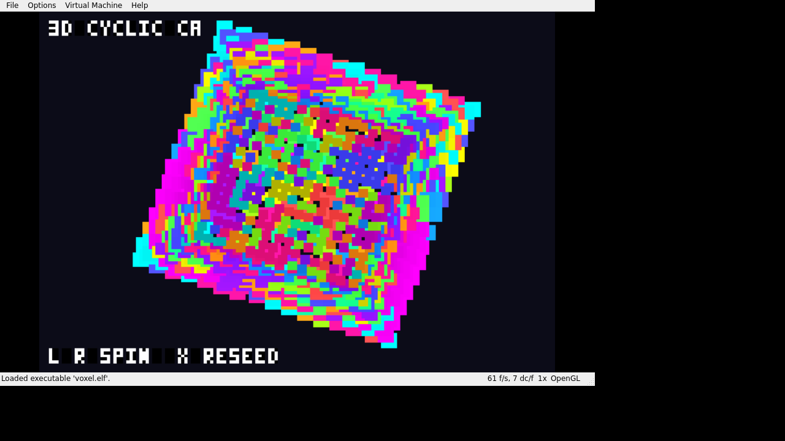

# ps2-forge

**An agentic-first PlayStation 2 game engine.** Tiny, readable C. One header,
~30 functions, 2D **and** 3D. The whole engine surface fits on one page
([`AGENTS.md`](AGENTS.md)) so an LLM agent, or you, can author a working PS2
game from a single read. Builds with the open `ps2dev` toolchain, runs in the
**Play!** emulator (no BIOS) or on **real PS2** hardware.

<p align="center">
  
</p>

## A game is one file

```c
#include "engine.h"
typedef struct { int x, y; } Game;

static void init  (void *s, Ctx *c){ }
static void update(void *s, Ctx *c){ Game *g=s; if (ctx_is_held(c,BTN_LEFT)) g->x--; }
static void render(void *s, Ctx *c){ Game *g=s; e_rect(c, g->x,100, 12,12, 255,90,90); }

int main(void){
    static Game g;
    Scene sc = { .state=&g, .init=init, .update=update, .render=render };
    app_run(config_default(), &sc);
}
```

3D is three calls:

```c
e3d_begin(c, yaw, pitch);
for (...) e3d_voxel(x,y,z, r,g,b);
e3d_end(c);
```

## Why "agentic-first"

- **One contract.** [`AGENTS.md`](AGENTS.md) is the complete API + build + run +
  conventions + examples. An agent reads it, copies `examples/template`, emits a game.
- **A skill.** [`skills/make-ps2-game`](skills/make-ps2-game/SKILL.md) scaffolds,
  builds, and verifies a PS2 game.
- **A built-in test loop.** `make shot` builds the ELF, boots it headless, and
  screenshots it, so an agent iterates build → look → fix in one command.

## What's in the engine

2D: rects, an alpha-tested font atlas (`e_text`), rotated quads, textured
sprites, a dynamic framebuffer blit (`e_image_draw`, for cellular automata /
software renderers), hardware scissor. 3D: a software voxel renderer
(`e3d_*`), depth-sorted, one blit, 60fps. Plus pad input and ADPCM SFX.

## Quick start

```sh
# toolchain env (ps2dev): PS2DEV / PS2SDK / GSKIT on PATH — see AGENTS.md
cp -r examples/template mygame && cd mygame
make            # -> game.elf
make run        # boot in Play!   (or: Play --elf game.elf)
make shot       # headless screenshot -> shot.png
```

Examples: `examples/template` (2D), `examples/spin3d` (3D).

## Built with it

[emergent-systems-ps2](https://github.com/Ijtihed/emergent-systems-ps2) — a
collection of 16 cellular automata / emergent systems (Game of Life,
reaction-diffusion, physarum, particle life, a 60fps 3D cellular automaton, …)
running on real PS2 hardware. One example of what the engine can do.

## Credit & license

Engine code: MIT. Built on [PS2SDK](https://github.com/ps2dev/ps2sdk) and
[gsKit](https://github.com/ps2dev/gsKit) (ps2dev) — their licenses apply to them.
