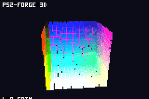
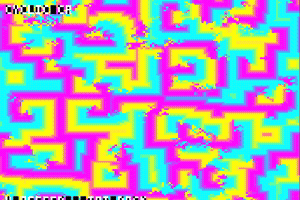
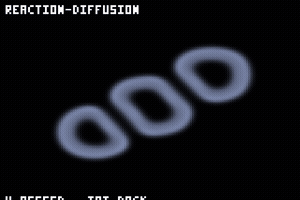
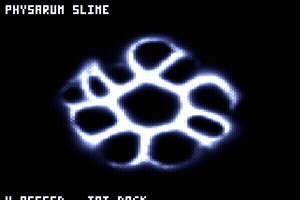
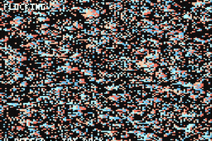

# ps2-forge

**Build PlayStation 2 games in one C file.** Tiny, readable C. One header,
~20 core functions, **2D and 3D**. The entire engine fits on a single page
([`AGENTS.md`](AGENTS.md)), so an AI agent (or you) can write, build, and run a
real PS2 game from one read. Builds with the open `ps2dev` toolchain; runs in the
**Play!** emulator (no BIOS needed) and on **real PS2 hardware**.

<p align="center">
  <br>
  <em>a 60fps 3D cellular automaton, running on a PlayStation 2</em>
</p>

### Made with ps2-forge

<table>
  <tr>
    <td align="center"><br>Cyclic CA</td>
    <td align="center"><br>Reaction-diffusion</td>
    <td align="center"><br>Physarum (slime mold)</td>
  </tr>
  <tr>
    <td align="center"><br>Multi-neighborhood CA</td>
    <td align="center"><br>Gray-Scott coral</td>
    <td align="center"><br>3D cellular automaton</td>
  </tr>
</table>

<sub>Six of the sixteen systems in the showcase app
(<a href="https://github.com/Ijtihed/emergent-systems-ps2">emergent-systems-ps2</a>),
all real PS2 output.</sub>

---

## A game is one file

```c
#include "engine.h"
typedef struct { int x, y; } Game;

static void init  (void *s, Ctx *c){ Game *g=s; g->x=160; g->y=120; }
static void update(void *s, Ctx *c){ Game *g=s; if (ctx_is_held(c,BTN_LEFT)) g->x--; }
static void render(void *s, Ctx *c){ Game *g=s; e_rect(c, g->x,g->y, 12,12, 255,90,90); }

int main(void){
    static Game g;
    Scene sc = { .state=&g, .init=init, .update=update, .render=render };
    app_run(config_default(), &sc);     /* engine owns the loop, GS, pad, timing */
}
```

3D is three calls:

```c
e3d_begin(c, yaw, pitch);
for (...) e3d_voxel(x,y,z, r,g,b);
e3d_end(c);
```

---

## Quickstart

**1. Toolchain (one time, no sudo):**
```sh
tools/bootstrap.sh        # downloads the prebuilt ps2dev toolchain
```
Export the `PS2DEV` / `PS2SDK` / `GSKIT` + `PATH` lines it prints.

**2. Make your game:**
```sh
cp -r examples/template mygame
cd mygame
# edit game.c   (optional: rename the output .elf via EE_BIN in the Makefile)
```

**3. Build, run, test:**
```sh
make          # -> game.elf   (a genuine MIPS R5900 / Emotion Engine executable)
make run      # boot it in the Play! emulator
make test     # build -> boot headless -> prints "RENDER: PASS|FAIL" + exit code
```

**4. Play it for real:** copy `game.elf` to a USB stick / memory card and launch
it on a PlayStation 2 via FMCB or wLaunchELF.

Examples: [`examples/template`](examples/template) (2D),
[`examples/spin3d`](examples/spin3d) (3D),
[`examples/life`](examples/life) (Game of Life, the `e_image_draw` grid pattern),
[`examples/jsport`](examples/jsport) (a ported JS game).

---

## The `forge` command (and a preview GUI)

Don't want to think about `make`? Use the bundled `forge` CLI:

```sh
./forge doctor          # check your toolchain is ready
./forge new mygame      # scaffold a new game in ./mygame
./forge build           # compile the game in this folder -> .elf
./forge run             # build + boot it in the emulator
./forge test            # build + boot headless + print RENDER: PASS/FAIL
./forge play spin3d     # build + run a bundled example
./forge gui             # open a web dashboard to browse + preview games
```

`forge gui` serves a local dashboard (http://localhost:8090) that lists every
example and, on click, **builds it, boots it headless, and shows the actual
rendered PS2 frame** plus a PASS/FAIL verdict. The fastest way to see what the
engine does. (The headless preview/test needs `Play!`, `Xvfb`, and a Python with
`mss` + `Pillow`; on a remote box, tunnel the port: `ssh -L 8090:localhost:8090 <host>`.)

---

## What's in the engine

**2D:** filled rects, an alpha-tested font atlas (`e_text`), rotated quads,
textured sprites, a dynamic framebuffer blit (`e_image_draw`, for cellular
automata / software renderers), and a hardware scissor.
**3D:** a software voxel renderer (`e3d_*`), depth-sorted, one blit, 60fps.
Plus D-pad/button input and ADPCM sound effects.

Full API + conventions on one page: **[`AGENTS.md`](AGENTS.md)**.

## Why "agentic-first"

- **One contract.** [`AGENTS.md`](AGENTS.md) is the complete API, build, run, and
  conventions. An agent reads it, copies `examples/template`, and emits a game.
- **A skill.** [`skills/make-ps2-game`](skills/make-ps2-game/SKILL.md) scaffolds,
  builds, and verifies a game.
- **A built-in verdict loop.** `make test` builds the ELF, boots it headless, and
  prints `RENDER: PASS/FAIL`, so the loop is **edit, one command, verdict**,
  no eyeballing.

## Porting a JS/TS game

Most agent-made games are HTML5-canvas or p5.js. Include
[`engine/canvas.h`](engine/canvas.h) and the calls line up nearly 1:1:

```c
cv_fill(90,200,255); cv_rect(x,y,8,8);   // ctx.fillStyle + ctx.fillRect
cv_text(8,8,"SCORE");                     // ctx.fillText
if (cv_key(BTN_LEFT)) x--;                // keyIsDown(LEFT_ARROW)
```

Full mapping table + a worked example: [`PORTING.md`](PORTING.md) and the
`port-js-to-ps2` skill.

## Built with it

[emergent-systems-ps2](https://github.com/Ijtihed/emergent-systems-ps2): sixteen
cellular automata / emergent systems (the GIFs above), including a 60fps 3D one,
running on real PS2 hardware.

## License

Engine code: MIT. Built on [PS2SDK](https://github.com/ps2dev/ps2sdk) and
[gsKit](https://github.com/ps2dev/gsKit) (ps2dev): their licenses apply to them.
